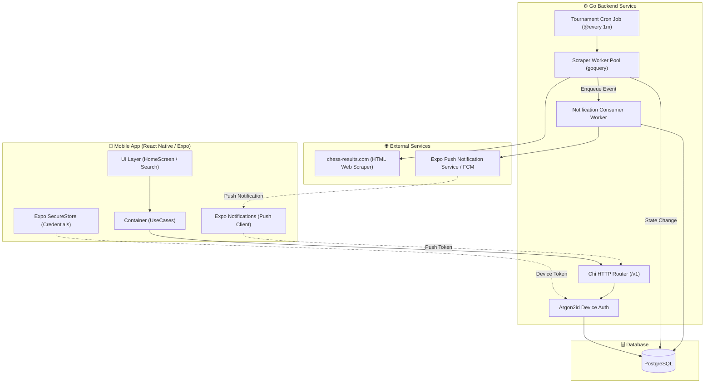
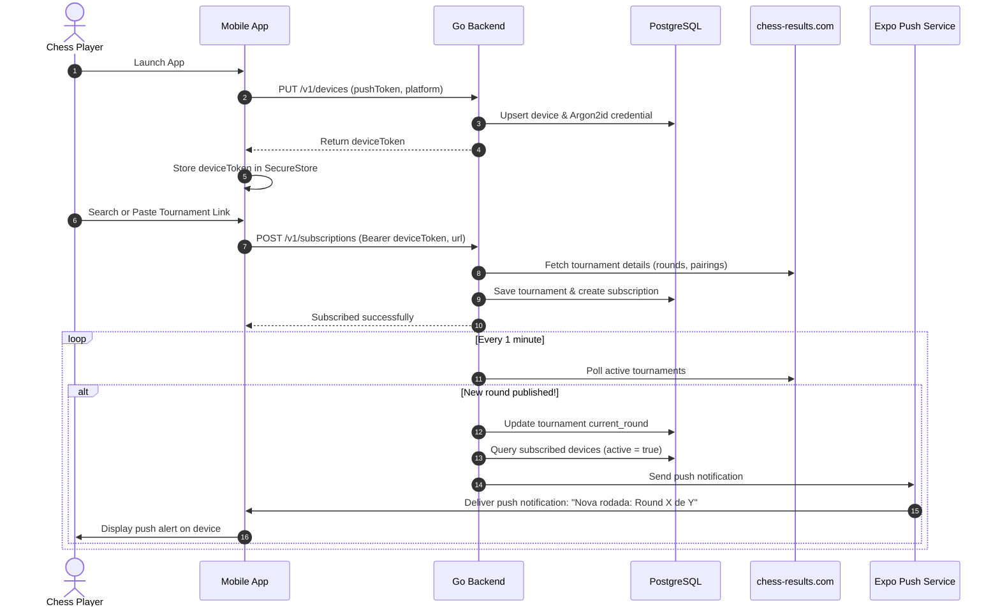

# ♟️ Chess Notify

[](https://go.dev)
[](https://reactnative.dev)
[](https://expo.dev)
[](https://www.postgresql.org)
[](https://tailwindcss.com)

**Chess Notify** is a real-time tournament tracking and notification ecosystem for competitive chess players, arbiters, coaches, and spectators.

Tournaments hosted on [chess-results.com](https://chess-results.com) publish round pairings, board assignments, and results at irregular intervals between rounds. Players are often stuck manually refreshing browser pages on their phones to find out who they are playing, what color pieces they have, and which board to sit at.

**Chess Notify eliminates that waiting game.** By subscribing to tournaments via link or in-app search, players receive instant push notifications the exact moment pairings for the next round are published.

---

## 🏛️ System Architecture



---

## 🚀 Key Features

- ⚡ **Automated Round Detection**: Background workers continuously scrape `chess-results.com` tournaments and immediately detect when new round pairings are posted.
- 📲 **Instant Push Notifications**: Delivered right to the user's lock screen via Expo Push Notifications and Firebase Cloud Messaging (FCM).
- 🔎 **Live Search & URL Parsing**: Follow any tournament by searching for its title in real-time or simply pasting a `chess-results.com` link.
- 🔐 **Zero-Login Authentication**: Instant onboarding with anonymous device-bound credentials stored securely in device hardware via `expo-secure-store` and hashed on the backend with **Argon2id**.
- 🌐 **Trilingual (i18n)**: Fully translated into **English (`en`)**, **Portuguese (`pt`)**, and **Spanish (`es`)** with automatic device locale detection and manual toggle.
- 🎨 **Glassmorphism Design**: Sleek dark UI built with NativeWind v5 (Tailwind CSS v4) and hardware-accelerated blur effects.

---

## 📁 Repository Structure

```
chess-notify/
├── backend/                       # Go REST API, Scraper & Push Service
│   ├── cmd/main.go                # Server entry point
│   ├── docker-compose.yml         # PostgreSQL container setup
│   ├── internal/
│   │   ├── application/           # Config, routing, and lifecycle coordinator
│   │   ├── database/              # PostgreSQL connections and auto-migrations
│   │   ├── device/                # Device registration & Argon2id auth
│   │   ├── middleware/            # Device authentication & logging
│   │   ├── notification/          # Expo & FCM notification dispatch workers
│   │   ├── subscription/          # Device tournament subscriptions
│   │   ├── tournament/            # chess-results.com scraper & cron engine
│   │   └── utils/                 # JSON request/response generics
│   └── README.md                  # Detailed backend documentation
│
├── frontend/                      # React Native / Expo Mobile App
│   ├── src/
│   │   ├── app/                   # Expo Router file-based screens
│   │   ├── application/           # Clean Architecture use cases
│   │   ├── domain/                # Entities, value objects & contracts
│   │   ├── infrastructure/        # HTTP client, storage, i18n
│   │   ├── main/                  # Dependency injection container
│   │   └── presentation/          # Components, hooks, context & theme tokens
│   ├── app.json                   # Expo application configuration
│   └── README.md                  # Detailed frontend documentation
│
└── README.md                      # Monorepo project overview (this file)
```

---

## 🛠️ Tech Stack

### Backend
- **Language**: Go 1.26+
- **HTTP Routing**: [Chi Router](https://github.com/go-chi/chi)
- **Database**: PostgreSQL with `pgcrypto`
- **Web Scraping**: [goquery](https://github.com/PuerkitoBio/goquery)
- **Task Scheduling**: [robfig/cron](https://github.com/robfig/cron)
- **Push Services**: [exponent](https://github.com/9ssi7/exponent) (Expo Push API) & Firebase Admin SDK (FCM)
- **Cryptography**: Argon2id (`golang.org/x/crypto/argon2`)

### Frontend
- **Framework**: React Native 0.86 / [Expo SDK 57](https://expo.dev)
- **Navigation**: [Expo Router](https://docs.expo.dev/router/introduction/)
- **Styling**: [NativeWind v5](https://www.nativewind.dev/) / Tailwind CSS v4
- **Security**: [Expo Secure Store](https://docs.expo.dev/versions/latest/sdk/securestore/)
- **Push Client**: [Expo Notifications](https://docs.expo.dev/versions/latest/sdk/notifications/)
- **Internationalization**: [i18next](https://www.i18next.com/) & [react-i18next](https://react.i18next.com/)
- **Code Quality**: [Biome](https://biomejs.dev/)

---

## ⚡ Quick Start

### 1. Clone the Repository

```bash
git clone https://github.com/gwkayser/chess-notify.git
cd chess-notify
```

---

### 2. Start Backend & Database

1. Navigate to the backend directory:
   ```bash
   cd backend
   ```
2. Start the PostgreSQL database:
   ```bash
   docker compose up -d
   ```
3. Set up the `.env` file:
   ```bash
   cp .env.example .env 2>/dev/null || cat << 'EOF' > .env
   PORT=8080
   DATABASE_URL="host=localhost user=postgres password=secret port=5432 sslmode=disable"
   SECRET="your-argon2id-salt-secret-at-least-16-bytes"
   EOF
   ```
4. Run the Go server (migrations will execute automatically):
   ```bash
   go run cmd/main.go
   ```

*For more details on backend API endpoints and configuration, read [`backend/README.md`](backend/README.md).*

---

### 3. Start the Mobile Frontend

1. In a new terminal, navigate to the frontend directory:
   ```bash
   cd frontend
   ```
2. Install dependencies:
   ```bash
   bun install
   # or: npm install
   ```
3. Set up the `.env` file with your local IP address:
   ```bash
   echo "EXPO_PUBLIC_API_URL=http://<YOUR_LOCAL_IP>:8080" > .env
   ```
4. Start the Expo development server:
   ```bash
   bun run start
   # or: npx expo start
   ```
5. Press `a` for Android emulator, `i` for iOS simulator, or scan the QR code with **Expo Go** on a physical mobile device.

*For more details on frontend architecture, state management, and push notification credentials, read [`frontend/README.md`](frontend/README.md).*

---

## 🔄 End-to-End Workflow



---

## 📖 Module Documentation

- [Backend Documentation (`backend/README.md`)](backend/README.md)
- [Frontend Documentation (`frontend/README.md`)](frontend/README.md)

---

## 📄 License

This project is licensed under the [MIT License](frontend/LICENSE).
